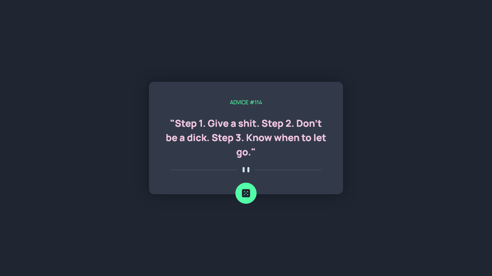
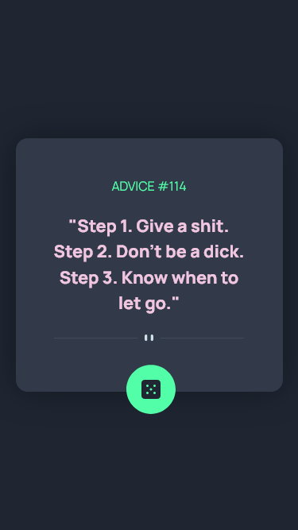

# Frontend Mentor - Advice generator app solution

This is a solution to the [Advice generator app challenge on Frontend Mentor](https://www.frontendmentor.io/challenges/advice-generator-app-QdUG-13db). Frontend Mentor challenges help you improve your coding skills by building realistic projects.

## Table of contents

- [Overview](#overview)
  - [The challenge](#the-challenge)
  - [Screenshot](#screenshot)
  - [Links](#links)
- [My process](#my-process)
  - [Built with](#built-with)
  - [What I learned](#what-i-learned)

## Overview

### The challenge

Users should be able to:

- View the optimal layout for the app depending on their device's screen size
- See hover states for all interactive elements on the page
- Generate a new piece of advice by clicking the dice icon

### Screenshot

### `Desktop` Page Preview



### `Mobile` Page Preview



### Links

- Solution URL: (https://advice-generator-chi-three.vercel.app/)

## My process

### Built with

- Semantic HTML5 markup
- CSS custom properties
- Flexbox
- CSS Grid
- Mobile-first workflow
- Vanilla Javascript(Fetch API)

### What I learned

I learned how to use a third party API like `Adviceslip` with the help of Vanilla Javascript `fetch() API`.

```js
async function getAdvicefromAPI(slip_id) {
  const API_URL = `https://api.adviceslip.com/advice/${slip_id}`;
  fetch(`${API_URL}`)
    .then((response) => {
      if (response.ok === true) {
        return response.json();
      } else {
        return Promise.reject(response);
      }
    })
    .then((data) => {
      addAdvice(data['slip']);
    })
    .catch((error) => {
      // There was an error
      alert('Something went wrong.\n' + error);
    });
}
```

I also learned how to use `Math obj` to random advice between 1 to 200.

```js
const slip_id = Math.ceil(Math.random() * 200);
```

I also created a random text color for each advice

```js
const randomColor = 'hsl(' + Math.random() * 360 + ', 60%, 86%)';
```
